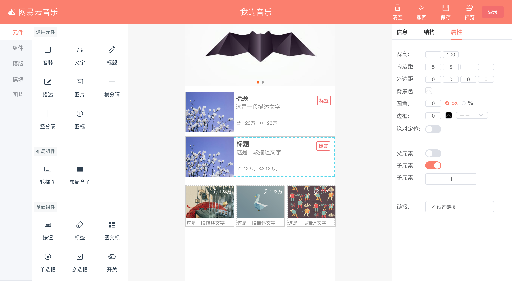

## H5 Editor

移动端页面 UI 生成器

用于将设计稿样式转化为组件化的代码

[本地启动方式](https://github.com/hyhajnal/h5-editor/tree/server)

> 有时间会持续更新维护的 😄

## 使用者
* **设计师**：通过拖拽编辑，生成UI稿
* **前端开发**：划分模块、组件、重命名 class ----> 代码

## 特性

* **编辑**： 拖拽编辑，属性编辑
* **预览**： 页面／模块／组件预览，导出对应的代码 `.vue文件`
* **模块划分**： 从页面中框选元素，划分为模块，并将该模块分配给对应的开发者；从模块中框选元素，划分为组件，继而生成组件化的代码
* **资源库**：元件`原生标签` ，组件`第三方UI组件库`，模版`拖拽生成的`
* **图标库**：填入 `iconfont` 的链接，会在 `head` 中自动添加` link` 标签，目前只支持一个页面一个 icon 链接
* **图片资源管理**：可以上传、删除图片、以及复制图片url，用于图片、轮播图组件

## 编辑区快捷键
* 按 ⌘+d 删除当前元素
* 按 ⌘+v 复制当前元素
* 按 ⌘+z 撤销（暂时只能撤销一次）
* 按 ⌘+s 暂存至本地
* 按 e 切换模块框选模式，按 esc 取消当前框选

## Todo
* 公共样式，变量
* 导入 sketch
* 操作历史
* 删除重复样式（考虑到有模版or元素的复制）

## 局限性

目前只限于移动端页面以及 vue 的转换

## 灵感来源
部分灵感和UI设计来源于

* 墨刀
* Fusion Design
* iconfont

## 参考

* https://github.com/ascoders/gaea-editor
* https://github.com/jaweii/Vue-Layout
* https://github.com/xinyu198736/sketch-to-html
* https://github.com/lzxb/flex.css/blob/master/docs/zh-ch.md
* http://f2e-assets.souche.com/projects/antd-editor/index.html#/?_k=mxsz5w

## 相关文章
* http://fex.baidu.com/blog/2014/04/realtime-collaboration/
* https://www.jianshu.com/p/840e0b0b2c6a
* http://www.alloyteam.com/2016/03/using-react-to-write-a-simple-activity-pages-design-of-operating-system-article/

## 编辑页截图

